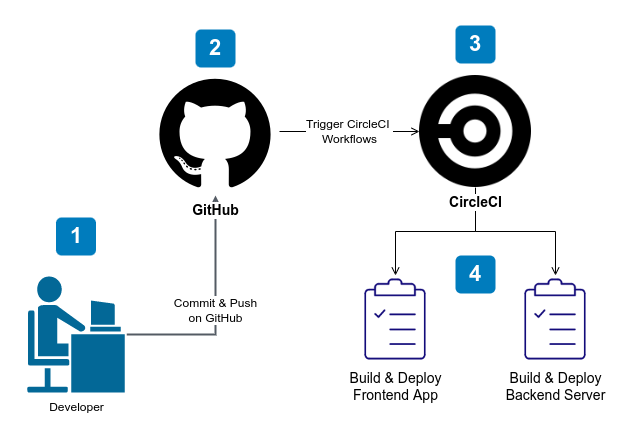

## Pipeline Process

## Continuous Integration (CI)

### GitHub

The developers commit changes and push the commited changes to the GitHub repository which is linked to the CircleCI dashboard. GitHub triggers the CircleCI pipeline when code is pushed to the repository.

### CircleCI

CircleCI pipelines are configured inside the `.circleci/config.yml` file which automate deployment of CircleCI application by creating jobs that a CircleCI pipeline should run.

There are 2 jobs in this project to be run in the CircleCI pipeline.

- **Backend**:

  - Install application dependencies
  - Build and archive application
  - Exports all environment variables from CircleCI configuration to a `.env` file.
  - Deploy application using Elastic Beanstalk CLI (EB CLI).

- **Frontend**:
  - Install application dependencies
  - Build assets of the frontend application.
  - Uploads the build assets to S3 using AWS CLI.
